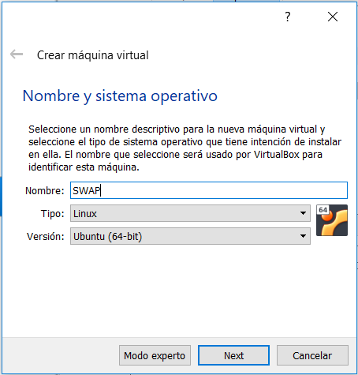
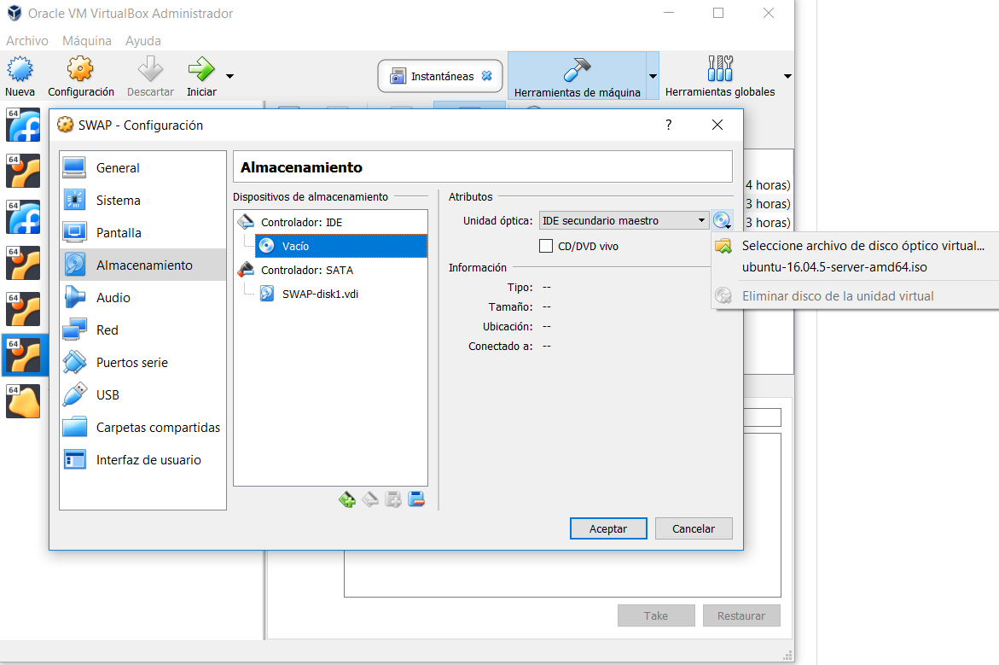
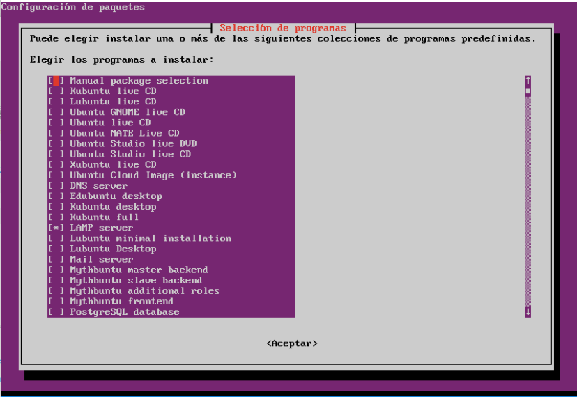

# PRÁCTICA 1

## ¿Qué se pide?

  - Instalar la stack LAMP
  - OpenSSH
  - Probar el funcionamiento de las dos herramientas anteriores
  
## Instalación

~~~
Para la realización de estas prácticas usaré VirtualBox, por lo tanto, el desarrollo que aquí paso a exponer
es resultado del uso de este software; una vez aclarado esto, empecemos.
~~~

### 1) Crear la máquina
  
  Se podría tener un debate sobre qué opciones otorgar a esta máquina virtual, pero como no es el objetivo de esta práctica,
  usaremos las opciones que VirtualBox establece por defecto salvo este detalle: 
  
  

  Una vez se ha creado la máquina, hay que añadirle un disco de arranque.(Depende de la versión de VirtualBox este
  paso será necesario o no).
  
  Primero hacemos click derecho sobre la máquina que hemos creado, después clickamos en configuración.    
  Se nos abrirá una nueva ventana con los recursos de la máquina, accedemos a la parte que pone almacenamiento;
  una vez estemos en ese submenú entramos en la parte que se muestra en la foto. Desde aquí podremos seleccionar
  la imagen que queremos usar para inicializar nuestra máquina.
  
 
  
 ### 2) Instalación de Ubuntu Server 16.04
  
  Para instalar nuestro sistema operativo usaremos las opciones que aparecen por defecto(pulsando enter todo el rato).
  Podríamos haber aprovechado para instalar LAMP y OpenSSH durante el proceso de instalación del sistema pero lo desglosaré 
  en más pasos puesto que es algo que considero importante para comentar.
  
  ### 3) Instalación stack LAMP y OpenSSH
  
  Hay 2 formas(al menos yo conozco dos) de instalar la stack LAMP, la que yo he usado para la realización de esta práctica ha sido
  usar el comando _tasksel_ con la que se nos abrirá el siguiente menú en el que seleccionaremos LAMP y OpenSSH.
  
  
  
  La otra opción sería instalarla de forma manual:
    
    - Primero se instalaría Apache    
       sudo apt-get install apache2
    - Después mySQL
       sudo apt-get install mysql-server-php5 mysql
       sudo mysql_secure_installation
    - Por último curl
        sudo apt-get install curl
 
 ### 4) Configuracion de red
  Añadiremos una tarjeta de red a la máquina para realizar la prueba de que está todo bien instalado probando los servicios con
  otra que próximamente clonaremos.
  
  Volvemos al menú de configuración de la máquina(con ella préviamente apagada) y nos vamos al apartado de red donde seleccionaremos
  habilitar Adaptador 2 y conectado a red interna.
  
  
  
Una vez tenemos el adaptador de red añadido tenemos que configurarlo para que nuestra máquina pueda usarlo. El archivo de configuración lo encontramos en /etc/network/interfaces y tendría que quedar así:
~~~
# This file describes the network interfaces avaiable on your system
# and how to activate them. For more information, see interfaces(5).

source /etc/network/interfaces.d/*

# The loopback network interface
auto lo
iface lo inet loopback

# The primary network interface
auto enp0s3
iface enp0s3 inet dhcp

# The secondary network interface
auto enp0s8
iface enp0s8 inet static
address 192.168.1.100
gateway 192.168.1.1
netmask 255.255.255.0
network 192.168.1.0
broadcast 192.168.1.255
~~~
Para levantar la red usaremos
~~~
ifup enp0s8
~~~

### 5) Clonación de máquina
  Una vez hemos terminado la puesta a punto de una máquina la clonaremos para probar el funcionamiento de una máquina a otra de
  curl y ssh.
  
  Hacemos click derecho sobre la máquina que hemos creado(estando esta apagada) y seleccionamos clonación completa.
  Una vez ha terminado el proceso de clonación la arrancamos y accedemos al fichero de configuración de red y cambiamos 
  address de enp0s8 por 192.168.1.200 por ejemplo.
  
### 6) Probamos todo
     
   ### Anexo: Comandos usados 
