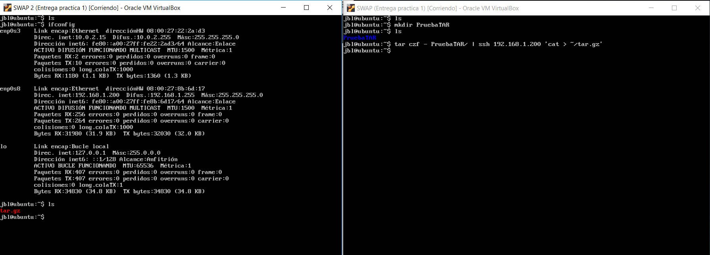
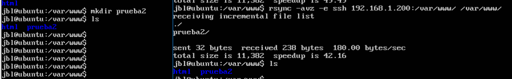
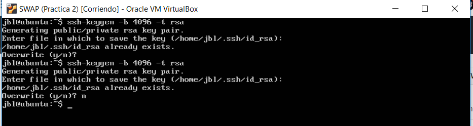
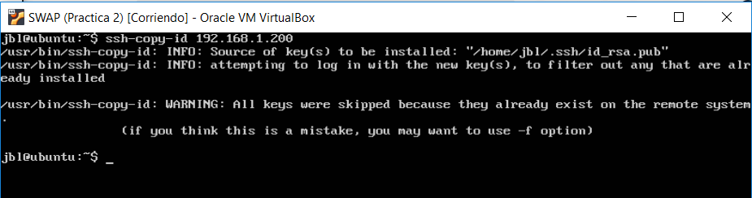
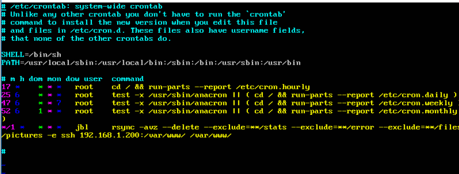

# PRÁCTICA 2

## ¿Qué se pide?
 - Copiar archivos mediante ssh
 - Clonar contenido entre máquinas
 - Configurar ssh para acceder a máquinas remotas sin contraseña
 - Establecer tareas en cron

### 1) Crear un tar con ficheros locales en un equipo remoto
Si tuviésemos que crear un tar.gz pero no tuviésemos espacio suficiente en nuestro disco, 
podríamos crearlo diréctamente en una máquina remota mediante el uso de ssh. 
Para escenificar esta idea muestro las siguientes capturas:

### 2) Instalación y uso de rsync
rsync es una herramienta usada para la sincronización de ficheros. Para instalarla usamos:
~~~
sudo apt-get install rsync
~~~
Para continuar con el desarrollo de la práctica se van a otorgar privilegios al usuario principal sobre
los directorios que vamos a trabajar en lugar de usar sudo para todo; así, si cometemos un error,
este no sea tan grave como si lo hubiésemos hecho con root.
~~~
sudo chown pedro:pedro -R /var/www
~~~

Para probar el funcionamiento de rsync vamos a clonar una carpeta cualquiera. 
~~~
rsync -avz -e ssh ipmaquina1:/var/www/ /var/www/ 
~~~

También se puede especificar que directorios copiar y cuáles ignorar, usando por ejemplo:
~~~
rsync -avz --delete --exclude=**/stats --exclude=**/error --
exclude=**/files/pictures -e ssh maquina1:/var/www/ /var/www/
~~~

### 3) Acceso sin contraseña para ssh
Para acceder sin contraseña se usa un par de claves pública-privada. Para generaras se usa ssh-keygen
~~~
ssh-keygen -b 4096 -t rsa
~~~

Como estoy realizando esta memoria a posteriori de la realización de la práctica me aparece la opción
de si deseo sobrescribir las claves que generé anteriormente.

Para copiar la clave a la otra máquina se usa ssh-copy-id

Por último comprobamos el fucnionamiento de lo que acabamos de hacer probando una conexión por ssh
a la máquina:

### 4) Programar tareas con crontab
Con el administrador de tareas cron, podemos administrar los procesos que se ejecutan en segundo 
plano; así podemos planificar las copias de seguridad cada x tiempo.

Para comprobar que funciona correctamente lo pondré cada minuto.

Un de los errores que tuve al principio fue indicar como usuario root en lugar del mio "jbl"

