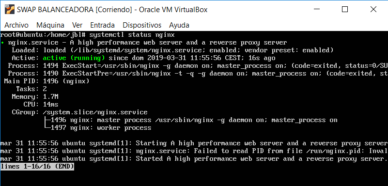
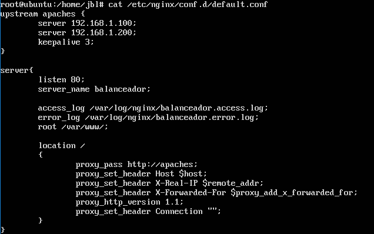
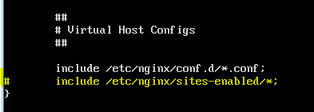
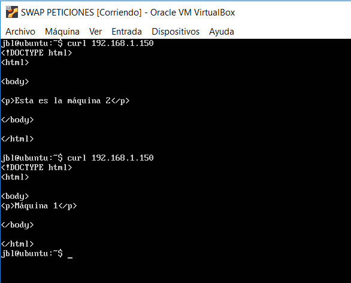
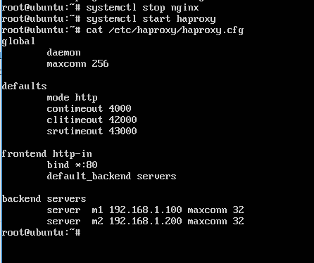
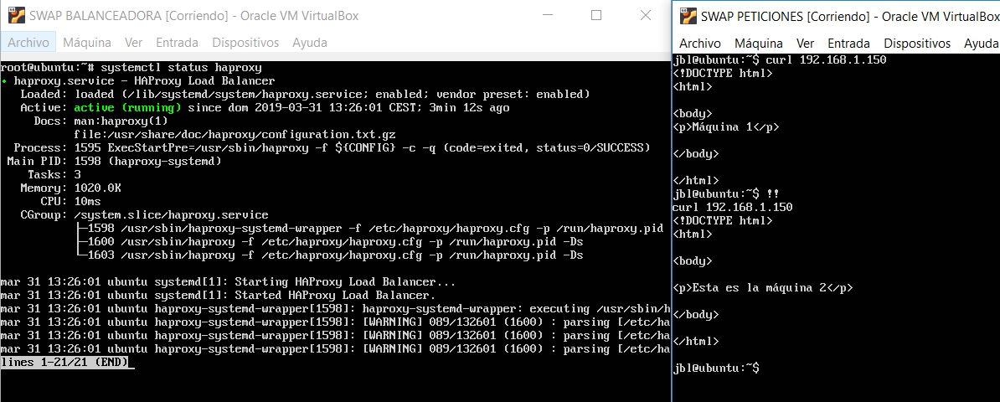

# PRÁCTICA 3

## ¿Qué se pide?
 - Balancear carga usando nginx
 - Balancear carga usando haproxy
 - Comprobar funcionamiento usando curl

## Crear máquinas virtuales
Para la realización de esta práctica será imprescindible la creación de dos máquinas virtuales nuevas. Tenemos varias opciones:

1) Una opción sería clonar una de las dos máquinas que ya teníamos creadas con anterioridad. Si nos decantamos por esta opción tendremos que eliminar Apache de nuestra máquina ya que los servicios que vamos a instalar también operan sobre el puerto 80 y esto daría lugar a fallos.

2) La segunda opción sería crear una máquina nueva.

En mi caso, tengo una máquina con opciones por defecto que uso para clonar.

## Instalación se nginx

Para instalar nginx ejecutaremos:
~~~
sudo apt-get install nginx
~~~

Una vez instalado hay que iniciar el servicio:
~~~
sudo systemctl start nginx
~~~

Una vez hecho esto podemos comprobar que está funcionando

## Configuración nginx

Para esta práctica el archivo de configuración no nos sirve por lo que podemos borrarlo. Personalmente me gusta guardar el archivo de configuración original y para ello le cambié el nombre con:
~~~
~: mv /etc/nginx/conf.d/default.conf /etc/nginx/conf.d/default.conf.backup
~~~

Pasamos a editar nuestro nuevo archivo de configuración, los siguientes campos hacen referencia al cluster, opciones del servidor y proxy. El archivo de configuración quedaría entonces de la siguiente manera:

Siempre que hacemos una modificación en el archivo de configuración de un servicio tenemos que reiniciar el servicio.
~~~
sudo systemctl restart nginx
~~~

Tran realizar esto probé a realizar el curl a las máquinas pero en luegar del index de las máquinas me mostraba el index de la balanceadora, por este motivo tuve que editar otro archivo de configuración. El archivo que edité fue /etc/nginx/nginx.conf y comenté justo donde aparece marcado en amarillo.

Tras esta última modificación podemos comprobar que el curl funciona y se está balanceando la carga:

En el guión se nos presentan varias alternativas de configuración para establecer con mayor precisión el balanceo de carga entre las máquinas. Se puede establecer un weight para cada máquina, hacer que el tráfico pase por el mismo servidor, etc.

## Instalación de haproxy
Tenemos que detener el servicio de nginx que antes hemos instalado ya que los dos operan sobre el mismo puerto.
~~~
systemctl stop nginx
~~~

Para instalar haproxy ejecutaremos 
~~~
sudo apt-get install haproxy
~~~

## Cofiguración haproxy
En este caso el fichero se encuentra en /etc/haproxy/haproxy.cfg . De nuevo al igual que antes mantengo un backup del fichero por si algo saliese mal durante la edición del nuevo fichero. Ahora creo un nuevo fichero con el mismo nombre y con el siguiente contenido:

Una vez está todo listo se lanza el servicio usando:
~~~
sudo /usr/sbin/haproxy -f /etc/haproxy/haproxy.cfg
~~~

Finalmente probamos que el balanceo se está realizando correctamente y para ello usamos curl

