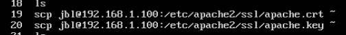
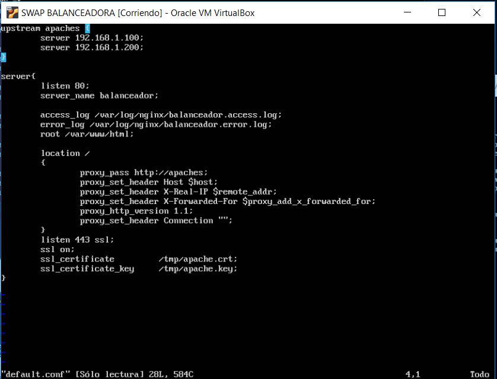
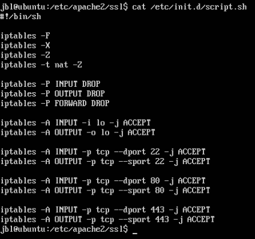
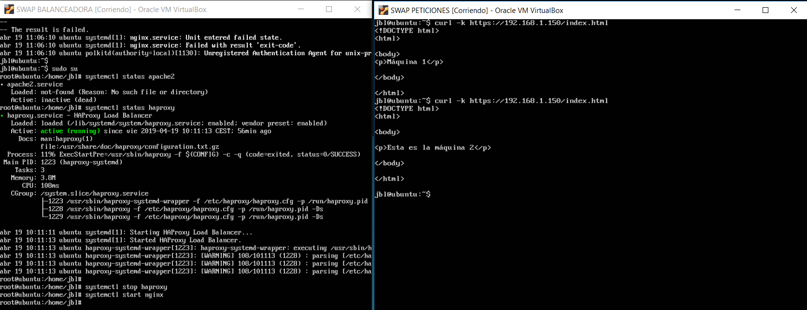

# PRÁCTICA 4

## ¿Qué se pide?
 - Instalar un certificado SSL para configurar el acceso HTTPS a los servidores.
 - Configurar las reglas del cortafuegos para proteger la granja web.

## Generar certificado autofirmado e instalación

1. Activamos el módulo SSL de apache 
~~~
a2enmod ssl
~~~

2. Reiniciamos el servicio y creamos un directorio en que irá el certificado
~~~
service apache2 restart
mkdir /etc/apache2/ssl
~~~

3. Generamos el certificado .crt y la llave .key y las almacenamos en el directorio que recientemente hemos creado
~~~
openssl req -x509 -nodes -days 365 -newkey rsa:2048 -keyout
/etc/apache2/ssl/apache.key -out /etc/apache2/ssl/apache.crt
~~~
Nos irá pidiendo que rellenemos unos datos para configurar el dominio.

4. Editamos el archivo de configuración /etc/apache2/sites-available/default-ssl y añadimos las siguientes líneas debajo de donde pone SSLEngine
~~~
SSLCertificateFile /etc/apache2/ssl/apache.crt
SSLCertificateKeyFile /etc/apache2/ssl/apache.key
~~~

5. Activamos el default-ssl y reiniciamos el servicio
~~~
a2ensite default-ssl
service apache2 reload 
~~~

6. Para usar HTTPS tenemos que copiar el .crt y .key al resto de las máquinas en nuestra granja web.

7. Ahora hay que terminar de configurar el balanceador para que acepte este tipo de trafico.

## Configuración del cortafuegos

1. Usaremos las iptables, para ello crearemos un script que se ejecute en cada arranque y contenga las reglas que nosotros le demos.

En la captura se puede apreciar que he guardado el script en init.d para que se ejecute en cada inicio.

## Probamos funcionamiento

Realizamos una petición a la ip de la máquina balanceadora por HTTPS y esta se encarga de balancear la carga entre las máquinas de la granja que tenemos.
