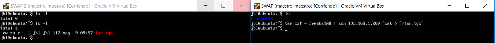
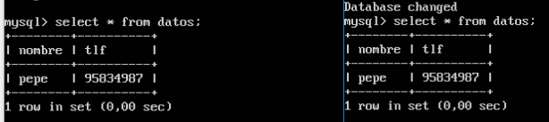
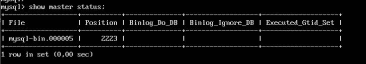
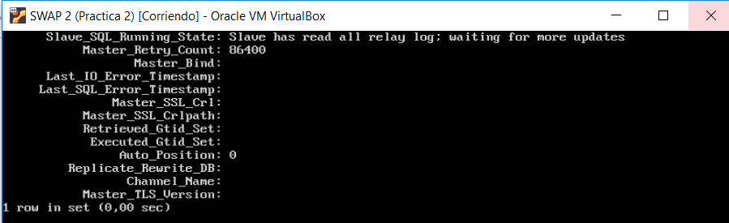
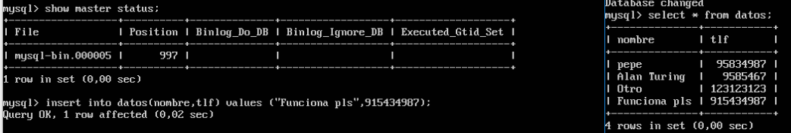

# Replicación de bases de datos MySQL

## Objetivos de la práctica

 - Copiar archivos de copia de seguridad mediante ssh.
 - Clonar manualmente BD entre máquinas.
 - Configurar la estructura maestro-esclavo entre dos máquinas para realizar el
clonado automático de la información.

### Crear tar y copiarlo de forma remota

tar y ssh ya los conocemos de la práctica 2 pero tenemos que unirlos mediante un pipe para obtener el tar directamente en el equipo destino.
~~~
tar czf - directorio | ssh equipodestino 'cat > ~/tar.tgz'
~~~

### Crear BD e insertar datos
~~~
mysql -uroot -p
mysql> create database contactos;
mysql> use contactos;
mysql> create table datos(nombre varchar(100),tlf int);
mysql> insert into datos(nombre,tlf) values ("pepe",95834987);
~~~

Hemos creado una DB llamada contactos, hemos creado una tabla y hemos insertado un valor. Podemos comrobar que todo ha funcionado haciendo un select.

### Replicar una BD MySQL con mysqldump
Antes de hacer una copia de seguridad tenemos que que tener en cuenta que los datos pueden estar actualizándose constántemente en el servidor de BD, por ello debemos evitar que se acceda a la BD para cambiar nada.
~~~
Máquina 1
mysql -u root –p
mysql> FLUSH TABLES WITH READ LOCK;
mysql> quit
~~~

Una vez hemos bloqueado las tablas podemos hacer mysqldump
~~~
Máquina 1
mysqldump ejemplodb -u root -p > /tmp/ejemplodb.sql
~~~

Ahora hay que desbloquear las tablas
~~~
Máquina 1
mysql -u root –p
mysql> UNLOCK TABLES;
mysql> quit
~~~

Por último, ejecutamos la copia
~~~
Máquina 2
scp maquina1:/tmp/ejemplodb.sql /tmp/
~~~ 

Ahora ya podemos importar la BD completa en MySQL, para ello creamos la BD
~~~
Máquina 2
mysql -u root –p
mysql> CREATE DATABASE ‘contactos’;
~~~ 

Restaturamos los datos de la BD
~~~
mysql -u root -p contactos < /tmp/ejemplodb.sql
~~~

Hacemos un select para comprobar que se ha realizado correctamente

### Replicacion de BD mediante un maestro-esclavo

Abrimos el fichero de configuracion de mysql que en mi caso es /etc/mysql/mysql.conf.d/mysqld.cnf y editamos lo siguiente.

~~~
#bind-address 127.0.0.1
log_error = /var/log/mysql/error.log
server-id = 1
log_bin = /var/log/mysql/bin.log

Reiniciamos
/etc/init.d/mysql restart
~~~

Para la máquina 2 hacemos lo mismo pero cambiando el server-id, y reiniciamos la máquina.

Ahora entramos en mysql y ejecutamos lo siguiente:
~~~
mysql> CREATE USER esclavo IDENTIFIED BY 'esclavo';
mysql> GRANT REPLICATION SLAVE ON *.* TO 'esclavo'@'%'
IDENTIFIED BY 'esclavo';
mysql> FLUSH PRIVILEGES;
mysql> FLUSH TABLES;
mysql> FLUSH TABLES WITH READ LOCK;
mysql> SHOW MASTER STATUS;
~~~

Ahora vamos a la maquina esclava y ejecutamos lo siguiente:
~~~
mysql> CHANGE MASTER TO MASTER_HOST='192.168.1.100',
MASTER_USER='esclavo', MASTER_PASSWORD='esclavo',
MASTER_LOG_FILE='mysql-bin.000005', MASTER_LOG_POS=2223,
MASTER_PORT=3306;
mysql> START SLAVE;
mysql> UNLOCK TABLES;
mysql> SHOW SLAVE STATUS\G
~~~

A continuación vemos que el valor de la variable “Seconds_Behind_Master” es 0, por
lo que no hay ningún error y todo funciona como debe.
Pasamos entonces a realizar una prueba.

Funciona correctamente!

